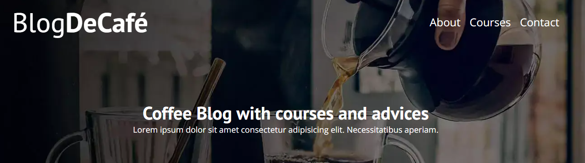
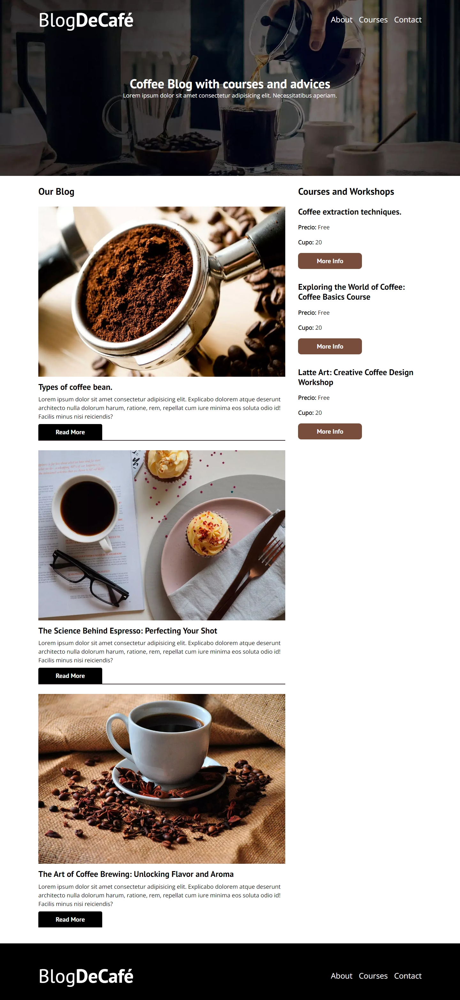

# BlogDeCafé

¡Bienvenidos al blog de Café Con Sabor, tu fuente de información sobre el apasionante mundo del café! En Café Con Sabor, nos dedicamos a compartir todo lo que necesitas saber sobre esta deliciosa bebida y la cultura que la rodea.

### Vista previa desde Desktop

## Cómo Usar BlogDeCafé

1. Visita la [página principal de BlogDeCafé](https://leyva9.github.io/Static-Projects/blogCoffee/index.html).
2. Explora nuestros artículos y reseñas sobre café.
3. Sumérgete en la cultura del café y descubre nuevas formas de disfrutarlo.

## Tecnologías Utilizadas

BlogDeCafé se ha desarrollado utilizando las siguientes tecnologías web:

- HTML5
- CSS3
- JavaScript

## Equipo de Desarrollo

- [Luis Manuel Leyva-Hernandez](https://github.com/Leyva9) - Desarrollador Principal

## Contribuciones

¡Valoramos las contribuciones de nuestros lectores! Si deseas contribuir a BlogDeCafé, aquí te explicamos cómo:

1. Contáctanos a través de nuestro correo electrónico para discutir tus ideas o artículos.

## Política de Derechos de Autor

Los contenidos de BlogDeCafé están protegidos por derechos de autor. Por favor, respeta nuestras políticas de uso y citación.

## Contacto

Si tienes alguna pregunta, sugerencia o comentario, no dudes en ponerte en contacto con nosotros a través de [leyva0919@gmail.com](mailto:leyva0919@gmail.com).

¡Esperamos que disfrutes de tu tiempo en BlogDeCafé y encuentres inspiración en el maravilloso mundo del café!
